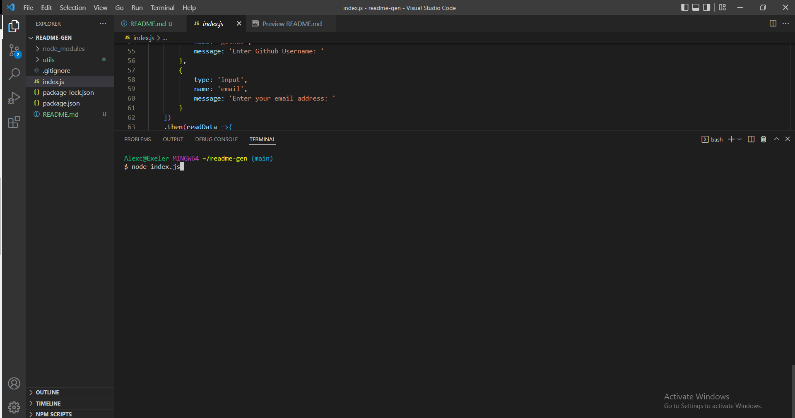

# ReadMe Generator 

## Table Of Content
  ### [Description](#description)
  ### [Links](#links)
  ### [Technology's Used](#technologys-used)
  ### [ScreenShots](#screenshots)

 

## Description
 Users will be propmted to answer question to fill out their readme file. Once the user has answered all the questions, a README.md file will be added to their root directory

## Links
Link to Github Repo: <a href='https://github.com/AlexUrielContreras/readme-gen'> README GEN</a> 
 
Link to Video Walkthrough: <a href='https://drive.google.com/file/d/1ebsj3XrcZPVN7nKVnVeSa7lLkd0DB3x5/view'>Walkthrough</a>

## Techology's Used
 * JavaScript

## ScreenShots
Invoke the app
